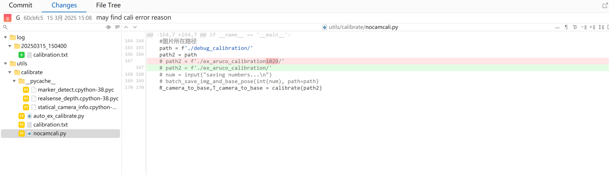
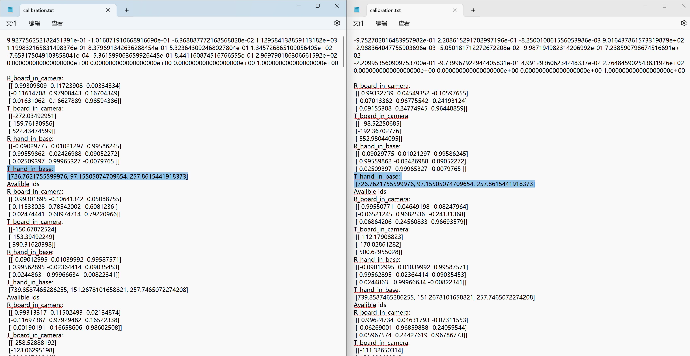

# 标定错误原因推断

在今天的实验中，我注意到使用同样的实验数据，在不同电脑环境上运行标定程序，会得到不同的结果。为了确保结论的正确性，我做了如下验证：

1. 通过检查git记录，确认了所有和标定有关的代码均未被做出重要更改；更改均发生在注释或print函数处[1]；

2. 通过检查控制台数据日志，确认了初始数据完全相同；同时计算所得出的矩阵存在差异[2]；

3. 在所有和标定有关的代码均未被做出重要更改的前提下，使用2024年9月的数据进行再次检验；通过查询git记录得知，计算得到的结果和当时的结果存在较大出入。

据此，可以得出推论：标定算法所使用的某些依赖库，在不同的版本进行计算时，可能会得到不同的结果。并且如下事实也支撑该推论：

1. 蔡学姐在我加入项目之前已经完成了标定算法，且工作正常；

2. 为了安装Grounding Dino，我使用的环境与蔡学姐的不同，包的版本相对较新；

3. 在我的环境下，没有一次标定是成功的。

故该推论理论成立。

[1] 所使用的nocamcali.py文件仅修改了一行注释；auto_ex_calibrate.py未使用，且只加入了一个未用到的变量；其他重要文件未修改：

[2] 通过选中数据（机械臂坐标原始数据）可知源数据相同；但是其他计算出来的数据存在较大差异：
