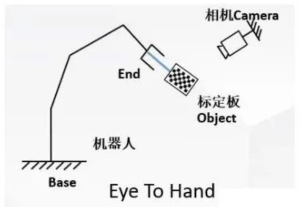
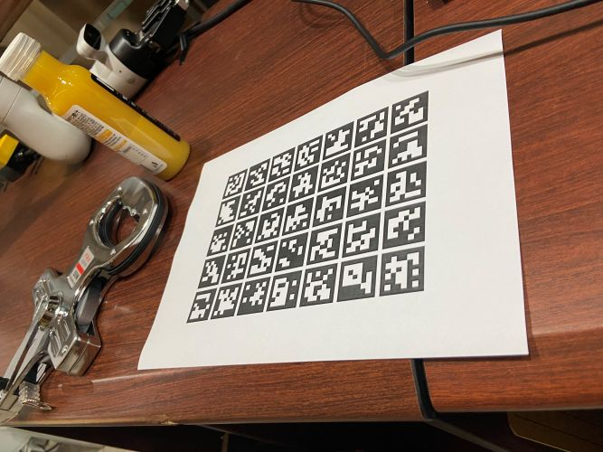
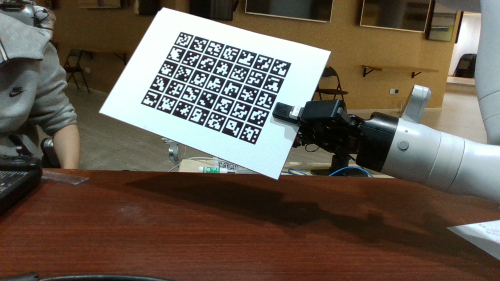

## 1. 基本原理（来自[这个仓库](https://github.com/RealManRobot/hand_eye_calibration)）
**这个仓库讲解较为详细，想详细了解标定算法的细节可以看看*
#### 1.1 概述
手眼标定通常用于机器人和计算机视觉领域，特别是在需要精确控制机械臂与环境交互的场景中去，手眼标定是将机械手和摄像机的坐标系统一起来，解决相机与机械手之间的坐标转换关系，让机械手能精确抓取到相机定位的目标。

手眼系统，是手（机械臂）和眼（相机）的关系，当眼（相机）看到一个物体的时候，需要告诉手（机械臂）物体的位置在哪里，物体在眼（相机）的位置确定了，如果此时有了眼（相机）和手（机械臂）的关系，我们就能得到物体在手（机械臂）的位置了。

当需要进行机器人抓取物体、动态环境交互、精密测量与检测、视觉伺服控制等多个场景时，都需要进行手眼标定。

#### 1.2 原理（眼在手外）



**眼在手外**标定时**固定机械臂基座和相机**，将**标定板固定在机械臂末端**，所以标定过程中**标定板与机械臂末端的关系固定不变，以及相机与机器人基座标的关系固定不变**

标定的目标：相机到机械臂基座坐标系的变换矩阵$$M^{base}_{camera}$$

实现方法：1.把标定板固定在机械臂末端

​					2.移动机械臂末端，使用相机拍摄不同机械臂姿态下的标定板图片n张 (10~20)

每次采集图片和机械臂位姿，都存在下面等式：$`M^{end}_{board} = M^{end}_{base} \cdot M^{base}_{camera} \cdot M^{camera}_{board}`$


其中：

| 符号               | 描述                         |
| ------------------ | ---------------------------- |
| $$^{end}_{board}M$$  | 标定板到机械臂末端的变换矩阵（因为标定过程中标定板固定在机械臂末端，标定板到机械臂末端的变化矩阵不变） |
| $$^{end}_{base}M $$    | 可以通过机械臂末端位姿算出   |
| $$^{base}_{camera}M$$  | 手眼标定需要求的             |
| $$^{camera}_{board}M$$ | 通过相机标定方法得到         |


则可以得到如下等式：

**The Cauchy-Schwarz Inequality**

$ ^{end}_{base}M_1 \cdot  ^{base}_{camera}M_1 \cdot ^{camera}_{board}M_1 = ^{end}_{base}M_2 \cdot ^{base}_{camera}M_2 \cdot ^{camera}_{board}M_2 \\ \parallel \\\ 
^{end}_{base}M_2^{-1} \cdot ^{end}_{base}M_1 \cdot  ^{base}_{camera}M_1 =^{base}_{camera}M_2 \cdot ^{camera}_{board}M_2 \cdot ^{camera}_{board}M_1^{-1}\\  ......   \\ 
^{end}_{base}M_n^{-1} \cdot ^{end}_{base}M_{n-1} \cdot ^{base}_{camera}M_{n-1}=^{base}_{camera}M_n \cdot ^{camera}_{board}M_n \cdot ^{camera}_{board}M_{n-1}^{-1}$

这也是是一个典型的**AX=XB**问题，而且根据定义，其中X是一个4X4齐次变换矩阵，其中R是相机到机械臂基坐标系的旋转矩阵，t是相机到机械臂基坐标系的平移向量：X = [[R, t], [0, 1]\]

手眼标定的目的就是为了计算出X。

## 2. 程序介绍
#### 2.1 文件结构
auto_ex_calibrate.py：正常标定主程序
nocamcali.py：在未外接摄像机和机械臂时，使用演示数据进行标定
marker_detect.py：包含标记点识别、三维点生成、pnp求解等函数的文件
visualization.py：可视化标定矩阵，显示两个坐标系之间的相对位置
calibration.txt：标定结果储存
debug_calibration：正常标定时，图像和机械臂位姿文件会保存在这里
debug_calibration_test：用于nocamcali的演示数据
其他：不常用或用不到

#### 2.2 工作流程
对于每一张标定图片，程序会根据预先设置的标定板尺寸生成每个二维码端点的3D坐标（即标定板的“3D模型”），和实际照片中二维码的位置进行pnp解算，获得Ts_board_in_camera（$^{camera}_{board}M_i$）；然后读取标定时保存的机械臂末端执行器位姿，解算Ts_hand_in_base（$^{end}_{base}M_i$）；最后，将所有图片的矩阵整合并使用calibrate_opencv进行求解，以得到（$^{base}_{camera}M$）。

## 3. 使用方法
#### 3.1 环境
首先需要安装四元数库：
```
pip install quaternions
```
对于其他依赖项而言，目前使用kortex gen3 + d435i的环境：

```
cd Requirements
pip install -r requirements.txt
python3 -m pip install kortex_api-2.6.0.post3-py3-none-any.whl
cd ..
```

如果更换机械臂或摄像机，则需要对内参（statical_camera_info.py）、程序与环境进行修改。

#### 3.2 使用
##### 3.2.1 环境测试（使用预先储存的数据）
```
python nocamcali.py
```
##### 3.2.2 标定板制作
1. 打印Pictures文件夹内的ori_aruco.jpg；大小无规定，但整个图像所占的大小以A5为宜

2. 材质选择：普通打印纸贴硬纸板、名片纸贴亚克力板、氧化铝薄膜贴浮法玻璃板等均可，根据经济状况和精度要求选择。主要的要求为二维码面不反光、平整、在标定过程中不变形、重量合适、抓取后不易滑动
3. 测量二维码大小与二维码之间的间距，保存到auto_ex_calibrate.py、nocamcali.py的grid_size、offset变量中
##### 3.2.3 实际标定
注意：在Vscode里运行可能会出现权限问题，而在终端运行不会
```
python auto_ex_calibrate.py
```
1. 运行上述程序
2. 在程序中输入采集的数量（大于等于20张）
3. 控制机械臂夹住标定板，**注意不能遮挡住aruco二维码！** 方向理论上无要求。

4. 移动机械臂，**保证所有的二维码都在摄像头视野内并且显示绿色框**，然后按下“S”键，保存图片和机械臂位姿
5. 移动机械臂，最好保证位置和角度都要更改，重复第5步
6. 采集20张后，程序会自动运行标定部分并将最终的标定矩阵保存到calibration.txt中
7. *可选：运行 visualization.py，查看标定结果是否正确。一般而言，相机的X轴在图像平面内，水平向右；Y轴在图像平面内，垂直向下；Z轴沿光轴方向，垂直于图像平面，指向场景为正方向（远离相机）*